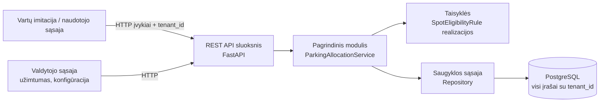

# ParkVieta – parkavimo vietų užimtumo ir paskyrimo sistema

Kursinio darbo I dalis: projektavimo dokumentas

## 1. Problema ir idėja

**Sistema vienu sakiniu:** ParkVieta yra SaaS sistema parkavimo aikštelių valdytojams. Pagal įvažiavimo ir išvažiavimo įvykius ji skaičiuoja laisvas vietas zonose ir atvykstančiam automobiliui parenka tinkamiausią laisvą vietą.

**Problema ir dabartinis procesas:** Biurų pastatų ir prekybos centrų aikštelėse vairuotojai dažniausiai patys važinėja tarp eilių ir ieško laisvos vietos. Daugelyje aikštelių bendras laisvų vietų skaičius rodomas tik prie įvažiavimo (jei rodomas), bet ne pagal zonas ir vietų tipus. Dėl to kyla keli trūkumai:
- vairuotojas nežino, kurioje zonoje yra vietų, ir gaišta laiką;
- elektromobilių krovimo ir neįgaliųjų vietas užima jų neturintys teisės naudotis automobiliai;
- valdytojas neturi patikimų duomenų apie zonų užimtumą, o skaitiklis dažnai „išsiderina“ (pvz., rodo neigiamą laisvų vietų skaičių, kai išvažiavimas užregistruojamas be įvažiavimo).

**Nauda:** Vairuotojas prie įvažiavimo iš karto gauna konkrečią vietą (pvz., „Zona A, vieta A-03“). Specialios vietos skiriamos tik tinkamiems automobiliams. Valdytojas mato tikslų užimtumą pagal zonas, o neteisingi įvykiai nesugadina skaičiavimų.

**Naudotojai:**
- **Aikštelės valdytojas** (kliento administratorius) – aprašo zonas ir vietas (tipas, atstumas iki įėjimo), peržiūri užimtumą ir įvykių istoriją.
- **Vartų sistema / vartų operatorius** – siunčia įvažiavimo ir išvažiavimo įvykius (prototipe imituojama per API arba mygtukus sąsajoje).
- **Vairuotojas** – mato jam paskirtą vietą arba pranešimą, kad aikštelė pilna.

**Prielaidos:**
- Darome prielaidą, kad automobilis identifikuojamas valstybiniu numeriu, o jo tipas (paprastas / elektromobilis) ir neįgaliojo leidimas žinomi įvykio metu (pvz., iš numerio atpažinimo ar vairuotojo pasirinkimo). Prototipe šie duomenys pateikiami įvykyje.
- Darome prielaidą, kad kiekvienas klientas (aikštelės valdytojas) pats nustato savo zonas, vietų tipus ir zonų prioritetų tvarką.
- Darome prielaidą, kad vairuotojas pastato automobilį paskirtoje vietoje. Faktinio vietos užėmimo tikrinimas sensoriais į apimtį neįeina.
- Žinome, kad specialių vietų naudojimo taisyklės (elektromobilių, neįgaliųjų) yra įprastos komercinėse aikštelėse.

## 2. Apimtis

| Funkcija | Ką naudotojas galės atlikti | Pagrindinis modulis ar pagalbinė funkcija |
|---|---|---|
| Įvykių registravimas ir tikrinimas | Vartų sistema siunčia įvažiavimo / išvažiavimo įvykį; sistema jį patikrina ir atnaujina užimtumą arba grąžina klaidą | **Pagrindinis modulis** |
| Vietos paskyrimas | Įvažiuojančiam automobiliui paskiriama tinkamiausia laisva vieta arba pasiūloma kita zona | **Pagrindinis modulis** |
| Užimtumo peržiūra | Valdytojas mato laisvų ir užimtų vietų skaičių pagal zonas ir vietų tipus | Pagalbinė funkcija |
| Aikštelės konfigūracija | Valdytojas aprašo zonas, vietas, jų tipus, atstumą iki įėjimo ir zonų prioritetą | Pagalbinė funkcija |
| Įvykių istorija | Valdytojas mato priimtus ir atmestus įvykius su atmetimo priežastimi | Pagalbinė funkcija |

**Į kursinio darbo apimtį neįeina:** tikri sensoriai, kameros ir numerių atpažinimas; mokėjimai ir parkavimo kainos skaičiavimas; vietų rezervavimas iš anksto; mobilioji programėlė; navigacija aikštelėje; savitarnos kliento registracija. Įvykiai prototipe siunčiami per API arba sąsajos mygtukus.

## 3. Pagrindinis modulis

**Pavadinimas ir atsakomybė:** `ParkingAllocationService` (užimtumo ir paskyrimo modulis). Jis patikrina gautą įvykį, palaiko teisingą kiekvienos vietos būseną ir įvažiuojančiam automobiliui parenka tinkamiausią laisvą vietą pagal vietų tipų ir zonų prioritetų taisykles.

**Logika, kurią reikės projektuoti ir testuoti:**
- įvykių validacija (dublikatai, išvažiavimas be įvažiavimo, nežinoma zona);
- vietos tipo ir automobilio atitikties taisyklės;
- geriausios vietos parinkimas (atstumas iki įėjimo, lygiaverčių vietų atvejis);
- konflikto sprendimas, kai pageidaujama zona pilna (perėjimas į kitą zoną pagal prioritetą);
- užimtumo invariantai (laisvų vietų skaičius visada tarp 0 ir zonos talpos).

**Įvestis:** Įvykis su kliento, zonos ir automobilio duomenimis. Pavyzdys:
```json
{
  "tenant_id": "biuru-centras-a",
  "event_type": "ENTRY",
  "plate": "LTA123",
  "vehicle_type": "EV",
  "has_disability_permit": false,
  "preferred_zone": "A",
  "timestamp": "2026-11-10T08:15:00"
}
```

**Išvestis:** Paskyrimo rezultatas arba klaida su kodu. Pavyzdžiai:
```json
{ "status": "ASSIGNED", "zone": "A", "spot": "A-05", "spot_type": "EV", "free_in_zone": 7 }
```
```json
{ "status": "REJECTED", "error_code": "NO_ACTIVE_ENTRY", "message": "Automobilis LTA123 neturi aktyvaus įvažiavimo" }
```

**Veikimo eiga:**
1. Gaunamas įvykis ir nustatomas kliento kontekstas (`tenant_id`).
2. Įvykis validuojamas (taisyklė 1). Jei netinkamas – grąžinama klaida, būsena nekeičiama.
3. Jei tai išvažiavimas – automobilio vieta atlaisvinama, grąžinamas atnaujintas užimtumas.
4. Jei tai įvažiavimas – atrenkamos automobiliui tinkamos laisvos vietos pageidaujamoje zonoje (taisyklė 2).
5. Iš tinkamų vietų parenkama geriausia (taisyklė 3).
6. Jei zonoje tinkamų vietų nėra – ieškoma kitose kliento zonose pagal prioritetą (taisyklė 4).
7. Vieta pažymima užimta, įrašomas įvykis, grąžinamas rezultatas.

### Taisyklės arba sprendimo žingsniai

1. **Įvykių validacija.** Įvažiavimas atmetamas su `DUPLICATE_ENTRY`, jei tas pats numeris jau yra aikštelėje. Išvažiavimas atmetamas su `NO_ACTIVE_ENTRY`, jei numeris aikštelėje neužregistruotas. Įvykis su nežinoma zona atmetamas su `UNKNOWN_ZONE`. Atmetus įvykį, nė vienos vietos būsena nepasikeičia.
2. **Vietos tipo atitiktis.** Vieta `EV` skiriama tik elektromobiliui, vieta `DISABLED` – tik automobiliui su neįgaliojo leidimu, vieta `STANDARD` – bet kuriam automobiliui. Elektromobiliui pirmiausia ieškoma `EV` vietos, jei jos nėra – `STANDARD`. Automobiliui su leidimu pirmiausia ieškoma `DISABLED` vietos, jei jos nėra – `STANDARD`. Paprastas automobilis niekada negauna `EV` ar `DISABLED` vietos, net jei kitų laisvų nėra.
3. **Geriausios vietos parinkimas.** Iš tinkamų laisvų vietų parenkama ta, kurios atstumas iki įėjimo mažiausias. Jei atstumas vienodas – parenkama vieta su mažesniu numeriu (pvz., A-02 prieš A-07). Taip rezultatas visada vienareikšmis ir testuojamas.
4. **Pilnos zonos konfliktas.** Jei pageidaujamoje zonoje tinkamos vietos nėra, iš eilės tikrinamos kitos to paties kliento zonos pagal nustatytą prioritetą ir grąžinama pirma rasta tinkama vieta su požymiu `alternative_zone: true`. Jei tinkamos vietos nėra jokioje zonoje – grąžinama `LOT_FULL`, o automobilis neįleidžiamas.
5. **Užimtumo invariantas.** Kiekvienai zonai visada galioja `0 ≤ laisvos_vietos ≤ talpa`, o `laisvos + užimtos = talpa`. Joks įvykis negali pažeisti šios sąlygos; bandymas ją pažeisti laikomas klaida.

### Scenarijai būsimiems testams

| Scenarijus | Pradinės sąlygos ir konkreti įvestis | Veiksmas | Tikslus laukiamas rezultatas |
|---|---|---|---|
| Įprastas atvejis | Zonoje A laisvos STANDARD vietos A-01 (atstumas 10 m), A-02 (25 m), A-03 (40 m). Atvyksta paprastas automobilis LTA123, pageidaujama zona A | ENTRY įvykis | `ASSIGNED`, vieta A-01, zonoje A liko 2 laisvos vietos |
| Ribinis atvejis arba konfliktas | Zonoje A laisva tik EV vieta A-05. Zonoje B (prioritetas 2) laisva STANDARD vieta B-01. Atvyksta benzininis automobilis KLB456, pageidaujama zona A | ENTRY įvykis | `ASSIGNED`, vieta B-01, `alternative_zone: true`; EV vieta A-05 lieka laisva |
| Klaida arba neįmanomas rezultatas | Automobilis MNC789 aikštelėje neužregistruotas | EXIT įvykis MNC789 | `REJECTED`, `NO_ACTIVE_ENTRY`; visų zonų laisvų vietų skaičius nepakitęs |
| Klaida – pilna aikštelė | Visos kliento vietos užimtos | ENTRY įvykis paprastam automobiliui | `REJECTED`, `LOT_FULL`; užimtumas nepakitęs |
| Ribinis atvejis – dublikatas | LTA123 jau yra vietoje A-01 | Pakartotinis ENTRY įvykis LTA123 | `REJECTED`, `DUPLICATE_ENTRY`; LTA123 lieka vietoje A-01 |
| Klientų izoliacija | Klientas „biuru-centras-a“ turi zoną A; klientas „prekybos-centras-b“ taip pat turi zoną A | Kliento B kontekste siunčiamas EXIT įvykis automobiliui, stovinčiam pas klientą A | `REJECTED`, `NO_ACTIVE_ENTRY`; kliento A duomenys nepakitę ir nematomi |

**Jei modulis naudoja AI:** Netaikoma. Pagrindinė logika yra deterministinė, grindžiama taisyklėmis.

## 4. Kokybės atributas

### Pagrindinis atributas: palaikomumas (plečiamumas naujais vietų tipais)

**Pasirinktas atributas:** Palaikomumas.

**Kodėl svarbus šiai sistemai:** Skirtingi klientai turi skirtingų vietų tipų, o jų daugėja: vietos tik darbuotojams, šeimoms su vaikais, motociklams, VIP. Jei kiekvienas naujas tipas reikalautų keisti paskyrimo algoritmą, kiltų pavojus sugadinti jau veikiančias taisykles visiems klientams.

**Tikrinimo scenarijus ir sąlygos:** Įgyvendinus pagrindinį modulį su tipais `STANDARD`, `EV` ir `DISABLED`, pridedamas naujas vietos tipas `STAFF_ONLY` (vieta tik darbuotojams). Po pakeitimo paleidžiami visi ankstesni testai.

**Sėkmės kriterijus:** Naujas tipas pridedamas sukuriant vieną naują taisyklės klasę ir ją užregistruojant, nekeičiant esamų taisyklių klasių ir paskyrimo algoritmo kodo. Visi ankstesni testai praeina nepakeisti, o naujam tipui pridedami bent 2 nauji testai (tinkamas ir netinkamas automobilis).

**Numatytas projektavimo sprendimas:** Vietos tipo atitiktis įgyvendinama per bendrą sąsają `SpotEligibilityRule` (metodas `is_eligible(vehicle, spot)`), o kiekvienas tipas turi atskirą realizaciją (Strategy šablonas). Paskyrimo servisas dirba tik su šia sąsaja, todėl nepriklauso nuo konkrečių tipų (atvirumo / uždarumo principas).

**Kaip patikrinsiu vėlesniame etape:** Atskirame „git“ įsipareigojime (commit) pridėsiu `STAFF_ONLY` tipą ir parodysiu, kad `git diff` apima tik naują klasę, jos registraciją ir naujus testus. Visų testų rezultatus užfiksuosiu prieš ir po pakeitimo.

**Sprendimo kaina arba ribojimas:** Daugiau klasių ir abstrakcijos lygmuo nei paprastame `if/else` sprendime. Taisykles, kurios priklauso nuo kelių tipų tarpusavio prioritetų, gali tekti aprašyti papildoma konfigūracija, o ne vien naujomis klasėmis.

### Papildomas atributas: spartumas

**Pasirinktas atributas:** Spartumas (atsako laikas).

**Kodėl svarbus šiai sistemai:** Vieta turi būti paskirta, kol automobilis stovi prie vartų. Rytinio piko metu biurų pastato aikštelėje automobiliai atvyksta vienas po kito.

**Tikrinimo scenarijus ir sąlygos:** Vienam klientui sukuriamos 5 zonos po 200 vietų (1 000 vietų). Per 60 s siunčiama 300 įvažiavimo ir išvažiavimo įvykių (apie 5 įvykiai per sekundę), vietinėje aplinkoje, aprašytoje README.

**Sėkmės kriterijus:** 95 % įvykių apdorojami greičiau nei per 200 ms, o po testo nė viena zona nepažeidžia užimtumo invarianto (taisyklė 5).

**Numatytas projektavimo sprendimas:** Duomenų bazės indeksai laukams `(tenant_id, zone_id, status)` ir `(tenant_id, plate)`; vietos užėmimas atliekamas vienoje transakcijoje su eilutės užrakinimu, kad ta pati vieta nebūtų paskirta dviem automobiliams.

**Kaip patikrinsiu vėlesniame etape:** Apkrovos testas su „Locust“ arba paprastu Python skriptu, išsaugant atsako laikų procentilius ir tikrinant invariantą po testo.

**Sprendimo kaina arba ribojimas:** Transakcijos su užraktais gali lėtinti apdorojimą esant labai didelei vienalaikei apkrovai vienoje zonoje. Rezultatai vietinėje aplinkoje neatspindi debesijos aplinkos našumo.

## 5. Pradinė sistemos struktūra

### Paprasta schema



| Sistemos dalis | Atsakomybė |
|---|---|
| Vartų imitacija / naudotojo sąsaja | Įvažiavimo ir išvažiavimo įvykių siuntimas, paskirtos vietos arba klaidos rodymas |
| REST API sluoksnis | Užklausų priėmimas, kliento konteksto nustatymas, įvesties formato tikrinimas, atsakymų formavimas; verslo logikos neturi |
| Pagrindinis modulis (`ParkingAllocationService`) | Įvykių validacija, vietos parinkimas, pilnos zonos konflikto sprendimas, užimtumo invariantų užtikrinimas |
| Taisyklės (`SpotEligibilityRule`) | Kiekvieno vietos tipo atitikties automobiliui patikrinimas |
| Saugyklos sąsaja (`Repository`) | Duomenų skaitymas ir rašymas; kiekviena užklausa filtruojama pagal `tenant_id`, todėl vieno kliento kontekste kito kliento duomenys nepasiekiami |
| PostgreSQL duomenų bazė | Klientų, zonų, vietų, aktyvių parkavimų ir įvykių istorijos saugojimas |

**Planuojamos technologijos ir pasirinkimo priežastys:**
- **Python 3.12** – kalba, kurią gerai išmanau; tinka aiškiai verslo logikai ir greitam prototipui.
- **FastAPI** – paprastas REST API kūrimas, automatinė užklausų validacija („Pydantic“) ir „Swagger“ sąsaja demonstracijai.
- **PostgreSQL** – transakcijos ir eilučių užrakinimas, reikalingi, kad ta pati vieta nebūtų paskirta dviem automobiliams.
- **pytest** – pagrindinio modulio ir klientų izoliacijos testai; saugyklą galima pakeisti imitacija, todėl logiką galima testuoti be duomenų bazės.
- **Docker Compose** (III etapui) – viena komanda paleidžiama programa ir duomenų bazė.
- Paprasta HTML / JavaScript sąsaja vartų imitacijai ir užimtumo peržiūrai.

## 6. AI panaudojimas

### AI rengiant šį dokumentą

Rengdamas šį dokumentą naudojau AI.

| Priemonė ir užduotis | Ką panaudojau | Ką atmečiau arba perrašiau ir kodėl | Kaip patikrinau |
|---|---|---|---|
| Claude – kursinio darbo reikalavimų paaiškinimas ir temų idėjų generavimas | Visų trijų etapų reikalavimų santrauką ir kriterijus, kas yra tinkamas pagrindinis modulis (ne CRUD) | Atmečiau AI siūlytas sudėtingesnes temas (AI sąskaitų apdorojimas, darbo užmokesčio skaidrumo sistema), nes norėjau realistiškai įgyvendinamos apimties. Parkavimo temą pasiūliau pats | Palyginau su užduoties aprašu ir II užduoties reikalavimais |
| Claude – temos „parkavimo vietų rodymas“ išplėtimas į pagrindinį modulį | Pasiūlymą užimtumo rodymą papildyti vietų paskyrimo ir įvykių validacijos logika, kad modulis nebūtų vien CRUD | Atmečiau realių sensorių ir numerių atpažinimo naudojimą – įvykius imituosiu per API, kad apimtis būtų įgyvendinama per semestrą | Palyginau su užduoties aprašo reikalavimu „vien CRUD nepakanka“ |
| Claude – dokumento juodraštis pagal šabloną | Dokumento tekstą, taisykles, testų scenarijus, schemą ir darbų planą | Tekstą priėmiau kaip pradinį variantą; už kiekvieną teiginį atsakau pats ir jį taisysiu pagal dėstytojo komentarus | Patikrinau, ar visi šablono skyriai užpildyti ta pačia tvarka; testų scenarijų laukiamus rezultatus perskaičiavau pagal taisykles 1–5 |

### Planuojamas AI naudojimas kuriant sistemą

**Kur ir kam naudosiu AI:** Claude Code – projekto struktūros paruošimui, pasikartojančio kodo (API maršrutų, duomenų modelių) generavimui, testų atvejų pasiūlymams, refaktorinimo idėjoms ir README rengimui.

**Kaip tikrinsiu pasiūlymus ir sugeneruotą kodą:** Kiekvieną pakeitimą peržiūrėsiu prieš įsipareigojimą (commit). Pagrindinio modulio taisyklėms pirmiausia pats aprašysiu testus pagal 3 skyriaus scenarijus ir tik tada priimsiu AI pasiūlytą realizaciją, jei testai praeis. Tikrinsiu, ar AI neįdėjo verslo logikos į API sluoksnį ir ar visos saugyklos užklausos filtruojamos pagal `tenant_id`. Kodo, kurio negaliu paaiškinti, neįtrauksiu.

**Ar AI bus sistemos funkcionalumo dalis:** Ne. Pagrindinis modulis veikia pagal deterministines taisykles.

## 7. Tolesnių darbų planas

| Darbas | Apčiuopiamas rezultatas | Planuojama darbų seka |
|---|---|---|
| Projekto paruošimas | „GitHub“ repozitorija, FastAPI projekto struktūra, PostgreSQL prijungimas, pradinis README | 1 savaitė (iki spalio 18 d.) |
| Duomenų modelis ir klientų izoliacija | Lentelės klientams, zonoms, vietoms, parkavimams ir įvykiams; saugykla, filtruojanti pagal `tenant_id`; du klientai su pavyzdiniais duomenimis | 2 savaitė (iki spalio 25 d.) |
| Pagrindinis modulis ir testai | `ParkingAllocationService` su taisyklėmis 1–5; testai visiems 3 skyriaus scenarijams, įskaitant izoliacijos testą | 3–4 savaitės (iki lapkričio 8 d.) |
| API ir paprasta sąsaja | Įvykių siuntimo ir užimtumo peržiūros maršrutai, vartų imitacijos puslapis | 5 savaitė (iki lapkričio 12 d.) |
| Paleidimas ir dokumentacija | README su paleidimo ir testų komandomis, pavyzdiniais duomenimis ir demonstravimo žingsniais | Iki lapkričio 16 d. |

**Būsimo prototipo veikimo scenarijus:** Paleidus sistemą, bus paruošti du klientai: „Biurų centras A“ (zonos A ir B, iš viso 10 vietų, tarp jų 2 EV ir 1 neįgaliųjų) ir „Prekybos centras B“ (zona A, 5 vietos). Kliento A kontekste siųsiu įvažiavimo įvykį paprastam automobiliui ir tikėsiuosi, kad jam bus paskirta arčiausiai įėjimo esanti STANDARD vieta. Tada užpildysiu zonos A paprastas vietas ir parodysiu, kad kitas paprastas automobilis gauna vietą zonoje B, o EV vieta lieka laisva. Parodysiu klaidos atvejį (išvažiavimas be įvažiavimo), kai užimtumas nepakinta. Galiausiai kliento B kontekste bandysiu atlaisvinti kliento A automobilio vietą ir parodysiu, kad tai atmetama.

| Rizika arba neaiškumas | Kaip patikrinsiu arba sumažinsiu |
|---|---|
| Vienalaikiai įvykiai gali paskirti tą pačią vietą dviem automobiliams | Vietos užėmimą atliksiu vienoje transakcijoje su eilutės užraktu; parašysiu testą, kuris lygiagrečiai siunčia du įvažiavimus į zoną su viena laisva vieta, ir tikrinsiu, kad vienas iš jų atmetamas |
| Pamiršus `tenant_id` filtrą vienoje užklausoje, galimas kliento duomenų nutekėjimas | Filtrą įdėsiu į bendrą saugyklos bazinę klasę, o ne į kiekvieną užklausą atskirai; izoliacijos testus paleisiu kiekvienam naujam maršrutui |
| Taisyklių prioritetai (pvz., EV automobilis ir neįgaliojo leidimas vienu metu) gali būti neaiškūs | Prieš programuodamas aprašysiu prioritetų lentelę ir kiekvienam kombinuotam atvejui parašysiu testą |

## Šaltiniai, jei naudojote

Idėjai ir sprendimams naudojau kurso medžiagą: įvadinę paskaitą „Programų sistemų projektavimas“ (kokybės atributai, paprastumo ir palaikomumo principai) bei I ir II kursinio darbo užduočių aprašus. Kitų šaltinių nenaudojau. AI naudojimas aprašytas 6 skyriuje.
